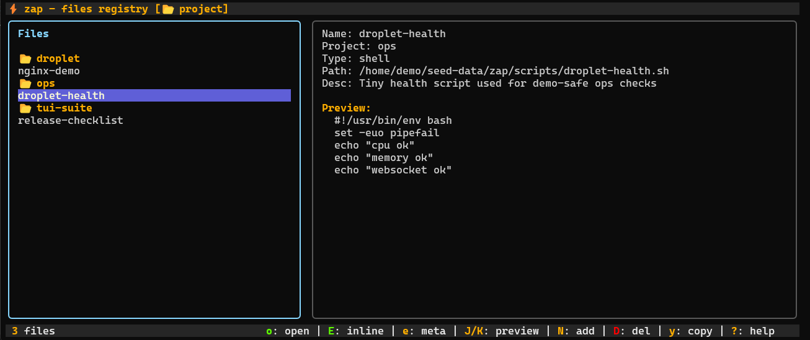

# zap

Personal file registry for the terminal. `zap` lets you register important files once, organize them by project, preview them quickly, and reopen them without hunting through directories every time.



**Live demo:** [froesch.dev](https://froesch.dev)

## Release Status

Developed for WSL2/Linux first. Cross-platform testing and bug fixing for macOS and native Windows are still in progress.

Linux, WSL2, and macOS are the primary targets today. Windows binaries and installer entrypoints are available, but native Windows should still be treated as experimental.

## Install

Quick install:

```bash
curl -fsSL https://raw.githubusercontent.com/LFroesch/zap/main/install.sh | bash
```

Experimental native Windows install:

```powershell
irm https://raw.githubusercontent.com/LFroesch/zap/main/install.ps1 | iex
```

Direct installers: [`install.sh`](https://raw.githubusercontent.com/LFroesch/zap/main/install.sh), [`install.ps1`](https://raw.githubusercontent.com/LFroesch/zap/main/install.ps1)

If you cloned the repo already:

```powershell
./install.ps1
```

```bat
install.cmd
```

Other options:

```bash
go install github.com/LFroesch/zap@latest
make install
```

Run:

```bash
zap
zap --version
```

## What It Stores

Registered files are saved in:

```text
~/.config/zap/zap-registry.json
```

`zap` does not move or copy your files. It only stores metadata and paths.

Path resolution order:

```text
$ZAP_REGISTRY_PATH -> $XDG_CONFIG_HOME/zap/zap-registry.json -> ~/.config/zap/zap-registry.json
```

Optional demo fallback:

```text
$ZAP_DEMO_DATA_PATH
```

If the primary registry file does not exist yet and `ZAP_DEMO_DATA_PATH` points at a valid registry JSON file, `zap` loads that seeded data for the session while still saving future edits to the primary registry path.

## Features

- Register files with a name, project, path, and description
- Search across saved file metadata
- Sort by project, recent, name, or path
- Preview file content in a right-hand pane
- Open the file or its parent directory in your editor
- Edit file metadata or edit the file inline
- Prevent duplicate registrations and save registry changes atomically

Editor resolution order:

```text
$VISUAL -> $EDITOR -> code
```

## Quick Start

1. Press `N`
2. Fill in the file metadata
3. Save
4. Press `enter` or `o` to open the selected file

## Controls

| Key | Action |
|-----|--------|
| `j/k` | Move |
| `g/G` | Top or bottom |
| `/` | Search |
| `S` | Change sort |
| `enter`, `o` | Open file |
| `O` | Open parent directory |
| `N` | Add file |
| `e` | Edit metadata |
| `E` | Edit file inline |
| `D` | Delete |
| `y` | Copy path |
| `r` | Refresh |
| `,` | Open config |
| `?` | Help |
| `q` | Quit |

## License

[AGPL-3.0](LICENSE)
